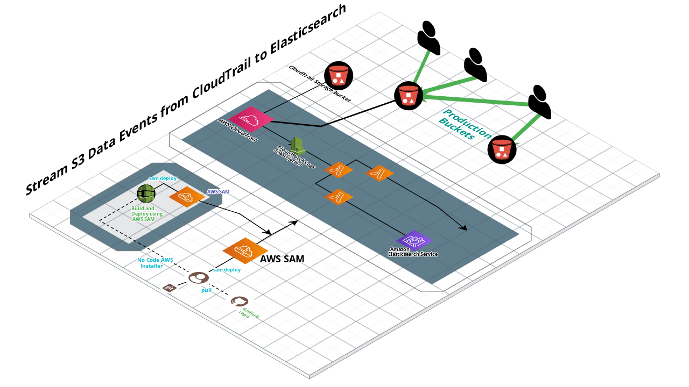

# Purpose

Provide an example of streaming S3 object-level logs from CloudTrail to Elasticsearch.

## How it works

1. Configure CloudTrail to log S3 data access events to CloudWatch log group. 
2. Subscribe Lambda to CloudWatch log group. 
3. Lambda receive(s) event(s), makes an API put request to Elasticsearch


## Architecture




## Pre-requisites

*Amazon Elasticsearch Service*

1. You need an existing Amazon Elasticsearch cluster running in an existing VPC. 
This should work with a non-Amazon Elasticsearch cluster too, but you may need
to tweak the CloudFormation template and/or Lambda function a bit. 

2. Install the AWS CLI

3. Install the AWS SAM CLI

*Elastic Cloud*

1. You need an existing elasticloud account and running cluster. 

2. Retrive the credentials and config data to populate the environment variables. 


## Cost

This template enables logging on all buckets within the template's launch region. 
Depending on the level of your S3 activity, you could potentially generate a 
signficant amount of log data, which has both cost and performance considerations.

You may want to initially adjust the demo to only apply to certain lower-volume
buckets and/or object filters. 

## Deployment 

1. Git clone this repository

    `git clone https://github.com/drumadrian/amazon-s3-access-logs-to-elasticsearch.git`

2. Change directory to the SAM folder:	*amazon-s3-access-logs-to-elasticsearch/sam-app*
	
	and provide config data when prompted by SAM: 

    ```sh
	git clone https://github.com/drumadrian/amazon-s3-access-logs-to-elasticsearch.git    
	cd amazon-s3-access-logs-to-elasticsearch/sam-app
	sam validate
	sam build
	sam deploy --guided
    ```

3. Put data into your Production bucket and view in Kibana: 

	Import the provided dashboard (TBD): 
	
    ```sh 
	kibana.json
	```
